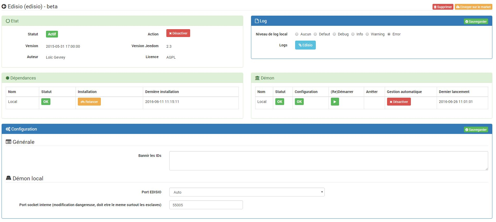

Plugin zur Verwendung des Edisio-Protokolls mit Jeedom

Konfiguration 
=============

Mit dem edisio-Plugin können Sie mit allen Geräten kommunizieren
kompatibel mit dem edisio USB Modul.

Plugin Konfiguration 
-----------------------

Nach dem Herunterladen des Plugins müssen Sie es nur noch aktivieren und platzieren
auf Auto tragen. Nach dem Speichern sollte der Dämon starten. Das Plugin
ist bereits standardmäßig konfiguriert; du musst nichts mehr tun.
Sie können diese Konfiguration jedoch ändern. Hier ist das Detail
(Einige Parameter sind möglicherweise nur im Expertenmodus sichtbar.) :

-   **Nebengebäude** : Dieser Teil gibt Ihnen den Status von Abhängigkeiten,
    Wenn sie nicht in Ordnung sind, können Sie sie entweder von Hand oder von Hand starten
    Warten Sie 5 Minuten, Jeedom wird sie von selbst starten.

-   **Dämon** : Dieser Teil gibt Ihnen den Status des Dämons (auch
    lokal als deportiert), wenn es nicht OK ist, können Sie auch
    von Hand starten oder 5 Minuten warten, Jeedom wird es von selbst starten.

> **Tip**
>
> Wenn Sie sich im Remote-Modus befinden, kann der lokale Dämon gestoppt werden
> ganz normal.

-   **Configuration** : In diesem Teil können Sie die Parameter konfigurieren
    Plugin allgemein.

    -   *Verbieten Sie die folgenden IDs* : erlaubt eine Liste zu geben
        edisio identifiziert Jeedom, damit es nicht schafft
        entsprechende Ausrüstung. Die Bezeichner müssen sein
        durch Leerzeichen getrennt. Beispiel : "1356AD87 DB54AF".

-   **Lokaler Dämon** oder **Dämon XXX** : Konfigurationseinstellungen
    lokal (oder entfernt, je nach Titel) des Dämons.

    -   *EDISIO Port* : der USB-Anschluss, an dem sich Ihre edisio-Schnittstelle befindet
        ist verbunden.

        > **Tip**
        >
        > Wenn Sie nicht wissen, welcher USB-Anschluss verwendet wird, können Sie
        > Geben Sie einfach "Auto" an".

    -   *Interner Socket-Port (gefährliche Änderung, muss identisch sein
        Wert auf alle Jeis deportiert edisio)* : lass uns
        Ändern Sie den internen Kommunikationsport des Dämons.

> **Important**
>
> Ändern Sie nur, wenn Sie wissen, was Sie tun.

Um den Daemon beim Debuggen zu starten, reicht dies auf Konfigurationsebene aus
Plugin-Protokolle zum Debuggen, Speichern und Neustarten des
Dämon.

> **Important**
>
> In diesem Modus ist der Dämon sehr gesprächig. Sobald das Debug beendet ist, ist es
> Vergessen Sie nicht, auf "Neustart" zu klicken, um den Modus zu verlassen
> Debuggen !! :

Gerätekonfiguration 
-----------------------------

Die Konfiguration der edisio-Geräte ist über das Menü zugänglich
Plugin :

So sieht die Seite des edisio Plugins aus (hier mit bereits 4
Ausrüstung) :

> **Tip**
>
> Setzen Sie die Maus wie an vielen Stellen auf Jeedom ganz links
> ruft ein Schnellzugriffsmenü auf (Sie können
> von deinen Profilen immer sichtbar lassen)

Sie finden hier :

-   eine Schaltfläche zum manuellen Erstellen von Geräten

-   eine Schaltfläche zum Umschalten auf Inklusion

-   eine Schaltfläche zum Anzeigen der Konfiguration des Plugins

-   Eine Schaltfläche, die Ihnen den Gesundheitszustand aller Ihrer Geräte anzeigt
    Edisio

-   Schließlich finden Sie unten die Liste Ihrer Ausrüstung

Sobald Sie auf eine davon klicken, erhalten Sie :

Hier finden Sie die gesamte Konfiguration Ihrer Geräte :

-   EDISIO Gerätename : Name Ihrer Edisio-Ausrüstung

-   Identifikation : die Identifikation Ihrer Sonde (darf nur bei vollständiger Kenntnis der Fakten geändert werden)

-   Aktivieren : macht Ihre Ausrüstung aktiv

-   Sichtbar : macht es auf dem Dashboard sichtbar

-   Übergeordnetes Objekt : Gibt das übergeordnete Objekt an, zu dem das Gerät gehört

-   Kategorie : Gerätekategorien (es kann gehören
    mehrere Kategorien)

-   Die Batterie nicht überprüfen : Sag Jeedom, er soll es dir nicht sagen
    Alarm, wenn das Gerät einen niedrigen Batterierahmen sendet
    (Einige Module verarbeiten diese Informationen nicht richtig und generieren sie
    falsche Warnungen)

-   Maximale Zeit zwischen 2 Nachrichten (min) : die maximale Verzögerung
    erlaubt zwischen 2 Nachrichten, bevor Jeedom die Ausrüstung deklariert
    im Timeout". Achtung, dieser Parameter muss konfiguriert sein
    die Option "Erzwinge die Wiederholung von Nachrichten alle (min)" und es
    muss größer als dieser Wert sein

-   Kommentar : ermöglicht es Ihnen zu kommentieren
    Ausrüstung (z : Batterie gewechselt am XX / XX / XXXX)

-   Gerät : Mit dieser Option können Sie das Modell Ihrer Ausrüstung definieren (nicht
    Konfigurieren Sie dies für die manuelle Erstellung eines Geräts.
    automatische Jeedom konfiguriert nur dieses Feld)

-   Schaffung : gibt Ihnen das Erstellungsdatum der Ausrüstung an

-   Kommunikation : gibt Ihnen das Datum der letzten Kommunikation mit
    das Gerät (kann zum Beispiel bei einer Steckdose leer sein)

-   Batterie : Batteriestand des Geräts

-   Status : Gerätestatus (kann zum Beispiel eine Zeitüberschreitung sein)

Nachfolgend finden Sie die Liste der Bestellungen :

-   Der im Dashboard angezeigte Name

-   Typ und Subtyp

-   der Schlüssel zu den Informationen, wenn es sich um eine Information handelt, oder der Code
    hexadezimal zu senden, wenn es sich um eine Aktion handelt. Die Konfigurationen
    Lassen Sie zu, dass diese Felder automatisch ausgefüllt werden (Sie müssen sie erstellen
    das Gerät, wählen Sie die Konfiguration und speichern Sie)

-   "Statusrückmeldungswert "und" Dauer vor Statusrückmeldung" : permet
    Jeedom darauf hinzuweisen, dass nach einer Änderung der Informationen
    Der Wert muss nach der Änderung auf Y, X min zurückkehren. Beispiel : dans
    der Fall eines Anwesenheitsdetektors, der nur während a emittiert
    Anwesenheitserkennung ist es nützlich, zum Beispiel 0 zu setzen
    Wert und 4 in der Dauer, so dass 4 min nach einem Nachweis von
    Bewegung (und wenn es seitdem keine Neuigkeiten mehr gibt) Jeedom
    setzt den Wert der Information auf 0 zurück (keine Bewegung mehr erkannt)

-   Chronik : ermöglicht das Historisieren der Daten

-   Anzeige : ermöglicht die Anzeige der Daten im Dashboard

-   Ereignis : im Falle von edisio muss diese Box immer sein
    aktiviert, da Sie kein edisio-Modul abfragen können

-   Unit : Dateneinheit (kann leer sein)

-   min / max : Datengrenzen (können leer sein)

-   erweiterte Konfiguration (kleine gekerbte Räder) : Anzeigen
    die erweiterte Konfiguration des Befehls (Methode
    Geschichte, Widget…)

-   Test : Wird zum Testen des Befehls verwendet

-   löschen (unterschreiben -) : ermöglicht das Löschen des Befehls

Betrieb an edisio Geräten 
------------------------------------

Oben auf Ihrer Gerätekonfigurationsseite haben Sie 3
Schaltflächen, mit denen Sie bestimmte Optionen ausführen können :

-   Duplikat : Geräte dupliziert

-   konfigurieren (kleine gekerbte Räder) : gleiches Prinzip wie für
    steuert, ermöglicht es eine erweiterte Konfiguration der Geräte

Aufnahme von Edisio-Geräten 
--------------------------------

Das Hinzufügen von Edisio-Geräten ist sehr einfach, Sie müssen es nur tun
Einschlussmodus und warten Sie, bis das Gerät eine Nachricht sendet, wenn es
wird der Fall sein Jeedom wird Ihnen sagen, dass es neue Ausrüstung enthalten hat und
wird diese automatisch erstellen.

Liste kompatibler Module 
============================

Sie finden die Liste der kompatiblen Module
[hier](https://jeedom.fr/doc/documentation/edisio-modules/fr_FR/doc-edisio-modules-equipement.compatible.html)

Ungelöste Direktive im Index.asciidoc - einschließen::faq.asciidoc \ [\]
