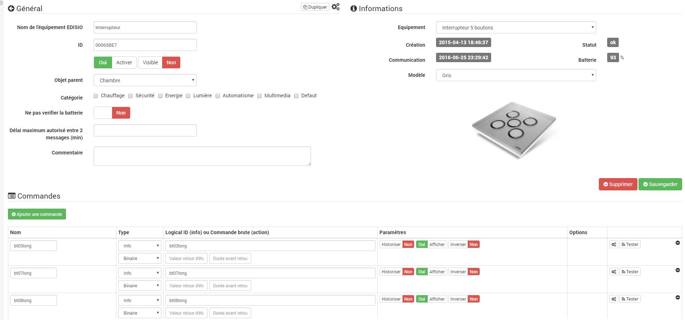

Konfiguration 
=============

.

Plugin Konfiguration 
-----------------------

. . Das Plugin
.
. 
 :

-   **Nebengebäude** : ,
    
    .

-   **Dämon** : 
    
    .

> **Spitze**
>
> 
> .

-   **Konfiguration** : 
    .

    -   ** : 
        
        . 
        . Beispiel : "".

-   **Lokaler Dämon** oder **Dämon XXX** : 
    .

    -   *EDISIO Port* : 
        .

        > **Spitze**
        >
        > 
        > ".

    -   *
        * : lass uns
        .

> **Wichtig**
>
> .

Dämon.

> **Wichtig**
>
> . 
> 
> Debuggen !! :

Gerätekonfiguration 
-----------------------------

Plugin :

 :

> **Spitze**
>
> 
> ruft ein Schnellzugriffsmenü auf (Sie können
> 

 :

-   

-   

-   

-   
    

-   

Sobald Sie auf eine davon klicken, erhalten Sie :

Hier finden Sie die gesamte Konfiguration Ihrer Geräte :

-   EDISIO Gerätename : 

-   Identifikation : 

-   Aktivieren : macht Ihre Ausrüstung aktiv

-   Sichtbar : macht es auf dem Dashboard sichtbar

-   Übergeordnetes Objekt : Gibt das übergeordnete Objekt an, zu dem das Gerät gehört

-   Kategorie : Gerätekategorien (es kann gehören
    mehrere Kategorien)

-   Die Batterie nicht überprüfen : 
    
    
    

-   Maximale Zeit zwischen 2 Nachrichten (min) : 
    
    ". 
    
    

-   Kommentar : ermöglicht es Ihnen zu kommentieren
     : 

-   Gerät : 
    
    

-   Schaffung : 

-   Kommunikation : 
    

-   Batterie : 

-   Status : 

Nachfolgend finden Sie die Liste der Bestellungen :

-   Der im Dashboard angezeigte Name

-   Typ und Subtyp

-   
    . 
    
    

-   "Statusrückmeldungswert "und" Dauer vor Statusrückmeldung" : erlaubt
    Jeedom darauf hinzuweisen, dass nach einer Änderung der Informationen
    Der Wert muss nach der Änderung auf Y, X min zurückkehren. Beispiel : IN
    der Fall eines Anwesenheitsdetektors, der nur während a emittiert
    Anwesenheitserkennung ist es nützlich, zum Beispiel 0 zu setzen
    
    
    

-   Chronik : ermöglicht das Historisieren der Daten

-   Anzeige : ermöglicht die Anzeige der Daten im Dashboard

-   Ereignis : 
    

-   Unit : Dateneinheit (kann leer sein)

-   min / max : Datengrenzen (können leer sein)

-   erweiterte Konfiguration (kleine gekerbte Räder) : Anzeigen
    die erweiterte Konfiguration des Befehls (Methode
    Geschichte, Widget…)

-   Test : Wird zum Testen des Befehls verwendet

-   löschen (unterschreiben -) : ermöglicht das Löschen des Befehls

 
------------------------------------

 :

-   Duplikat : 

-    : 
    

 
--------------------------------

.

 
============================

[ici](https://jeedom.fr/doc/documentation/edisio-modules/fr_FR/doc-edisio-modules-equipement.compatible.html)

.::]
