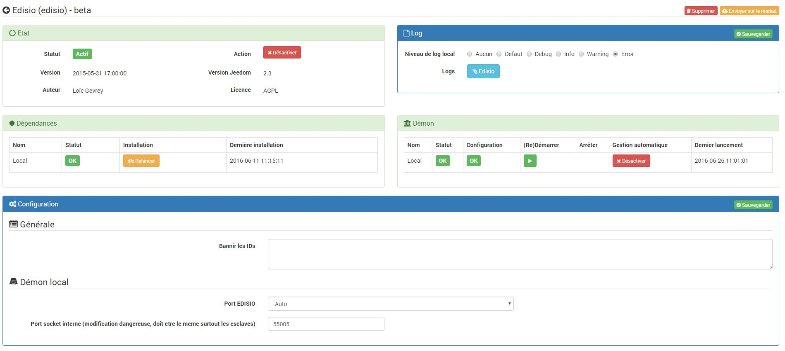
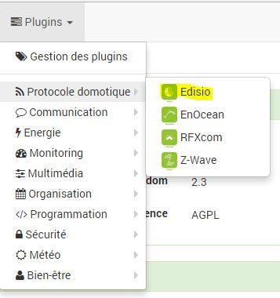
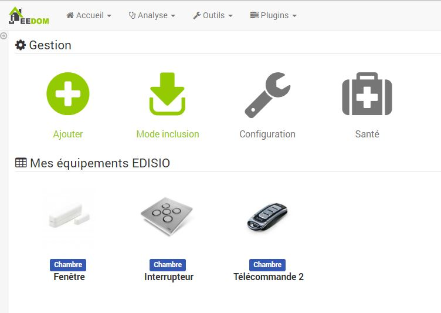
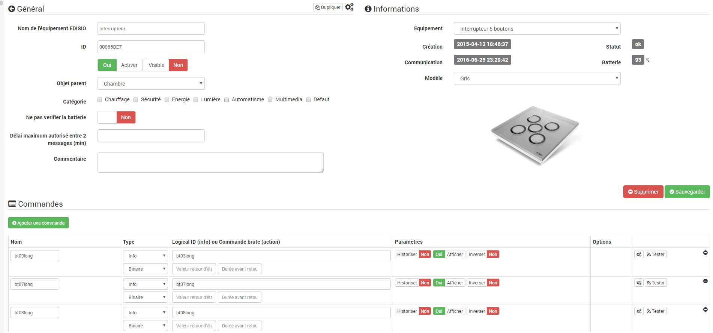

Plugin para usar el protocolo Edisio con Jeedom

Configuración 
=============

El complemento edisio te permite comunicarte con todos los dispositivos
compatible con el módulo edisio USB.

Configuración del Plugin 
-----------------------

Después de descargar el complemento, solo necesita activarlo y poner
vistiendo en auto. Después de salvar al demonio debería lanzar. El complemento
ya está configurado por defecto; no tienes que hacer nada más.
Sin embargo, puede modificar esta configuración. Aqui esta el detalle
(algunos parámetros solo pueden ser visibles en modo experto) :

-   **Dependencias** : esta parte le da el estado de las dependencias,
    si no están bien, puede iniciarlos a mano o
    espera 5 min, Jeedom los lanzará solo.

-   **Demonio** : esta parte te da el estado del demonio (también
    localmente que deportado), si no está bien, puede
    lanzar a mano o esperar 5 minutos, Jeedom lo lanzará solo.

> **Tip**
>
> Si está en modo remoto, el demonio local se puede detener, es
> completamente normal.

-   **Configuration** : esta parte le permite configurar los parámetros
    Plugin general.

    -   *Prohibir las siguientes identificaciones* : permite dar una lista
        identificadores edisio a Jeedom para que no cree
        equipo correspondiente. Los identificadores deben ser
        separados por espacios. Ejemplo : "1356AD87 DB54AF".

-   **Demonio local** o **Demonio XXX** : ajustes de configuración
    local (o remoto, según el título) del demonio.

    -   *Puerto EDISIO* : el puerto USB en el cual su interfaz edisio
        está conectado.

        > **Tip**
        >
        > Si no sabe qué puerto USB se utiliza, puede
        > simplemente indique "Auto".

    -   *Puerto de socket interno (modificación peligrosa, debe ser la misma
        valor en todos los Jeis deportados edisio)* : permite
        modificar el puerto de comunicación interna del demonio.

> **Important**
>
> Cambie solo si sabe lo que está haciendo.

Para iniciar el demonio en depuración es suficiente en el nivel de configuración
registros de complementos para depurar, guardar y relanzar el
Demonio.

> **Important**
>
> En este modo, el demonio es muy hablador.. Una vez que finaliza la depuración, se
> no olvides hacer clic en "Reiniciar" para salir del modo
> Depurar !! :

Configuración del equipo 
-----------------------------

Se puede acceder a la configuración del equipo edisio desde el menú
Plugin :

Así es como se ve la página del complemento edisio (aquí con 4 ya
equipo) :

> **Tip**
>
> Como en muchos lugares de Jeedom, coloca el mouse en el extremo izquierdo
> abre un menú de acceso rápido (puedes
> de tus perfiles siempre lo dejas visible)

Lo encuentras aqui :

-   un botón para crear equipos manualmente

-   un botón para cambiar a inclusión

-   un botón para mostrar la configuración del complemento

-   un botón que le da el estado de salud de todo su equipo
    Edisio

-   finalmente a continuación encontrará la lista de su equipo

Una vez que haces clic en uno de ellos, obtienes :

Aquí encontrarás toda la configuración de tu equipo :

-   Nombre del dispositivo EDISIO : nombre de su equipo edisio

-   Identificación : la Identificación de su sonda (se cambiará solo a sabiendas)

-   Activar : activa su equipo

-   Visible : lo hace visible en el tablero

-   Objeto padre : indica el objeto padre al que pertenece el equipo

-   Categoría : categorías de equipos (puede pertenecer a
    categorías múltiples)

-   No comprobar la batería : dile a Jeedom que no te diga
    alerta si el equipo envía un marco de batería baja
    (algunos módulos no manejan esta información correctamente y generan
    alertas falsas)

-   Tiempo máximo permitido entre 2 mensajes (min) : el retraso máximo
    permitido entre 2 mensajes antes de que Jeedom declare el equipo
    en tiempo de espera". Atención este parámetro requiere haber configurado
    la opción "Forzar la repetición de mensajes cada (min)" y
    debe ser mayor que este valor

-   Comentario : le permite comentar
    equipo (ex : batería cambiada en XX / XX / XXXX)

-   Dispositivos : le permite definir el modelo de su equipo (no
    configurar eso para la creación manual de un equipo,
    Jeedom automático configura este campo solo)

-   Creación : le da la fecha de creación del equipo

-   Comunicación : le da la fecha de la última comunicación con
    el equipo (puede estar vacío en el caso de una toma de corriente, por ejemplo)

-   Batería : nivel de batería del equipo

-   Estado : estado del equipo (puede ser tiempo de espera, por ejemplo)

A continuación encontrará la lista de pedidos. :

-   el nombre que se muestra en el tablero

-   tipo y subtipo

-   la clave de la información si es una información o el código
    hexadecimal para enviar cuando es una acción. Las configuraciones
    permitir que estos campos se completen automáticamente (debe crear
    el equipo, elija la configuración y luego guarde)

-   "Valor de retroalimentación de estado "y" Duración antes de la retroalimentación de estado" : permet
    para indicarle a Jeedom que después de un cambio en la información
    el valor debe volver a Y, X min después del cambio. Ejemplo : dans
    el caso de un detector de presencia que emite solo durante un
    detección de presencia, es útil establecer por ejemplo 0
    valor y 4 en duración, de modo que 4 minutos después de una detección de
    movimiento (y si no ha habido noticias desde entonces) Jeedom
    restablece el valor de la información a 0 (no se detecta más movimiento)

-   Guardar historial : permite historizar los datos

-   Mostrar : permite mostrar los datos en el tablero

-   Evento : en el caso de edisio este cuadro siempre debe ser
    marcado porque no puede consultar un módulo edisio

-   Unidad : unidad de datos (puede estar vacía)

-   min / max : límites de datos (pueden estar vacíos)

-   configuración avanzada (ruedas con muescas pequeñas) : Muestra
    La configuración avanzada del comando (método
    historia, widget ...)

-   Probar : Se usa para probar el comando

-   eliminar (firmar -) : permite eliminar el comando

Operación en equipos edisio 
------------------------------------

En la parte superior de la página de configuración de su equipo, tiene 3
botones que le permiten realizar ciertas opciones :

-   Duplicar : equipo duplicado

-   configurar (ruedas con muescas pequeñas) : mismo principio que para
    controles, permite una configuración avanzada del equipo

Inclusión de equipos edisio 
--------------------------------

Agregar equipos Edisio es muy simple, solo tienes que
modo de inclusión y espere a que el equipo envíe un mensaje, cuando
será el caso Jeedom le dirá que ha incluido nuevos equipos y
creará este automáticamente.

Lista de módulos compatibles. 
============================

Encontrará la lista de módulos compatibles.
[aquí](https://jeedom.fr/doc/documentation/edisio-modules/fr_FR/doc-edisio-modules-equipement.compatible.html)

Directiva no resuelta en el índice.asciidoc - incluye::faq.asciidoc \ [\]
