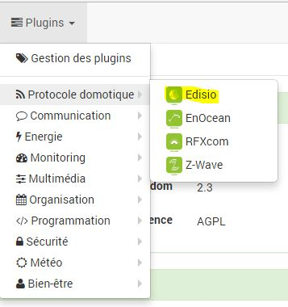

Configuração 
=============

.

Configuração do  
-----------------------

. . 
.
. 
 :

-   **Dependências** : ,
    
    .

-   **Demônio** : 
    
    .

> ****
>
> 
> .

-   **Configuração** : 
    .

    -   ** : 
        
        . 
        .  : "".

-   ****  **Demônio XXX** : 
    .

    -   *Porto EDISIO* : 
        .

        > ****
        >
        > 
        > ".

    -   *
        * : 
        .

> ****
>
> .

Demônio.

> ****
>
> . 
> 
> Depurar !! :

 
-----------------------------

 :

 :

> ****
>
> 
> 
> 

 :

-   

-   

-   

-   
    

-   

 :

 :

-   Nome equipamentos EDISIO : 

-    : 

-   Ativar : 

-   Visivél : 

-   Objeto pai : 

-   Categoria : 
    

-   Não verificar a bateria : 
    
    
    

-   Tempo máximo permitido entre 2 mensagens (min) : 
    
    ". 
    
    

-   COMMENTAIRE : 
     : 

-   Equipamento : 
    
    

-   Criação : 

-   Comunicação : 
    

-   Bateria : 

-   Estado : 

 :

-   

-   

-   
    . 
    
    

-   "" : 
    
    .  : Dans
    
    
    
    
    

-   Historicizar : 

-   Display : 

-   Evento : 
    

-   Unidade : 

-    : 

-    : 
    
    

-   Teste : 

-    : 

 
------------------------------------

 :

-   Duplicar : 

-    : 
    

 
--------------------------------

.

 
============================

[ici](https://jeedom.fr/doc/documentation/edisio-modules/fr_FR/doc-edisio-modules-equipement.compatible.html)

.::]
